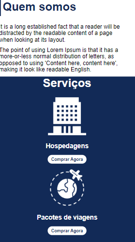
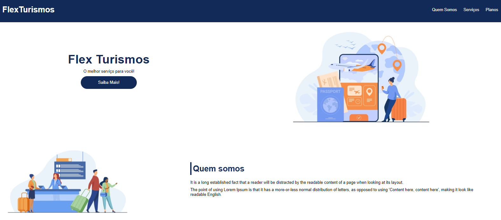

# Posicionando elementos com Flexbox em CSS

O objetivo desse projeto foi colocar em prática os conhecimentos adquiridos durante o curso da [Digital Innovation One](https://www.dio.me/).

## Tecnologias utilizadas

- HTML.
  
- CSS.
  
## Preview do projeto

Preview mobile

Preview desktop

## Como testar o projeto

### Opção 1: Clone o repositório e abra remotamente

Digite no seu terminal

``
git clone https://github.com/guilhermag/dio-flex-viagens.git
``

``
cd dio-flex-viagens/
``

Agora é só abrir o ``index.html``.

## Créditos

Desenvolvido por Guilherme de Araujo Gabriel, através das aulas apresentadas por Karen Santos / DIO.

